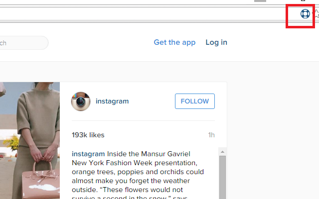

#  Harpoon for Instagram

Download any image or video from Instagram using the Harpoon for Instagram Google Chrome extension. Just click the blue buoy icon that is displayed in the address bar of any Instagram post.

## Installation

Install Harpoon for Instagram from the [Google Chrome Web Store](https://chrome.google.com/webstore/detail/harpoon-for-instagram/lkkabbnbhcbhadokgoanblepoadnkmio) or [manually]( https://developer.chrome.com/extensions/getstarted#unpacked).

## License

[The MIT License (MIT)](LICENSE)

Copyright (c) 2016 [Angelo Licastro](http://angelolicastro.com)

## Notice

Harpoon for Instagram is not affiliated with [Instagram](https://www.instagram.com). The Harpoon for Instagram name is compliant with the [Instagram Identity Guide](https://www.instagram-brand.com) (specifically, the Naming Apps and Products section). Instagram is copyright Instagram.

The blue buoy icon was generated by [FA2PNG](http://fa2png.io). FA2PNG converts [Font Awesome](http://fontawesome.io) icons to PNG. Font Awesome is copyright [Dave Gandy]( https://twitter.com/davegandy). FA2PNG is copyright [Jannik Weyrich](http://jannikweyrich.com) and [Stephan Groß](http://www.minddust.com).
